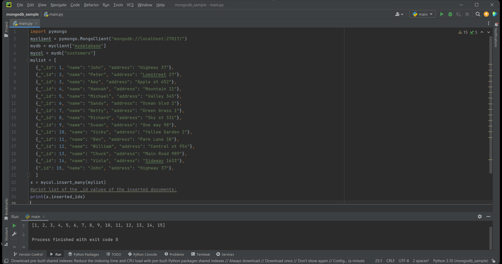
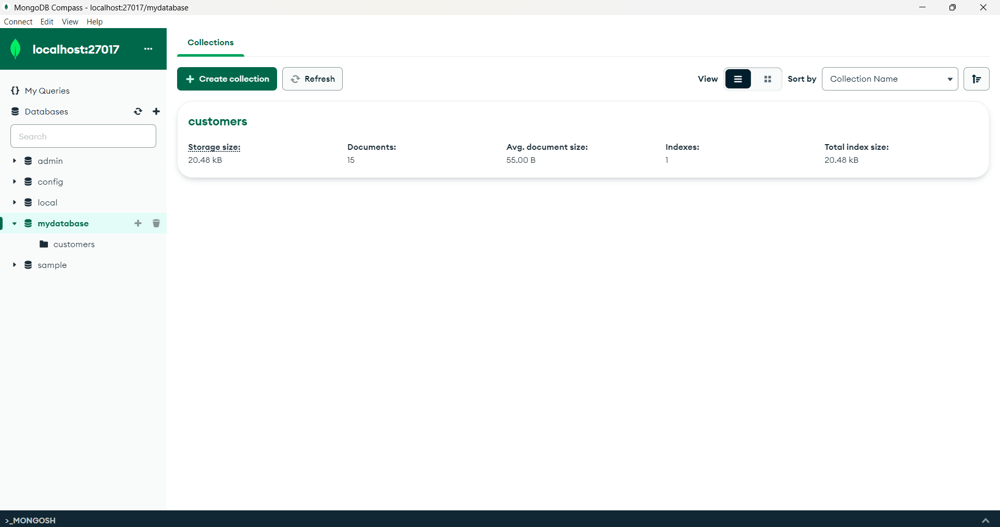
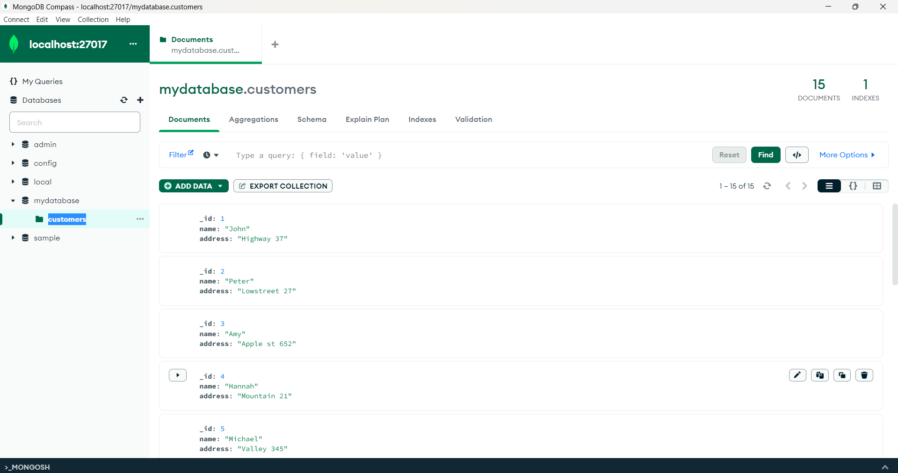
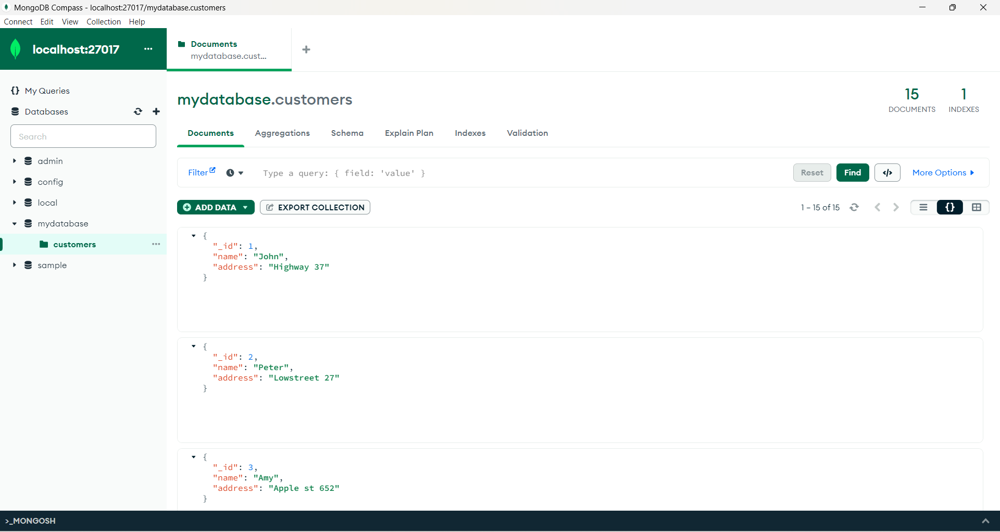
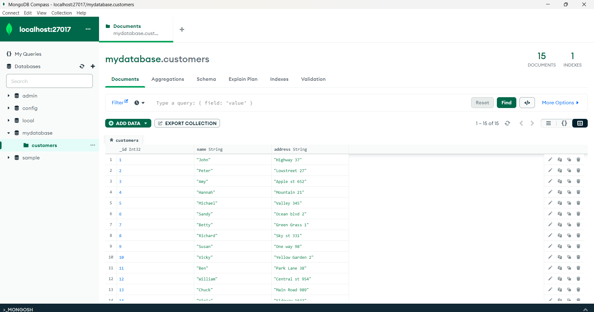
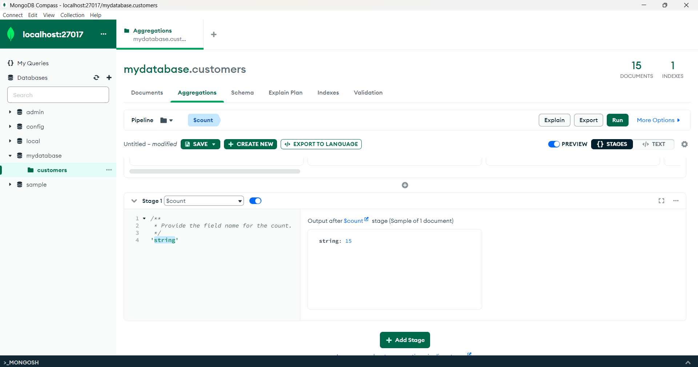

# DBMS-Assignment : 1


## CREATE AND CONNECT DATABASE WITH PYTHON

## AIM :
To create a database using the python code in pycham and connect it with mongodb.


## PROCEDURE :

1. TO install MongoDB and pycharm in your system.
2. write the python code in pycham to create a database.
3. write the python code in pycham to connect the created  database with MongoDB.
4. Run the program to create the database and to make the connection.
5. Then the database is connected with MongoDB.

## CODE :
```
import pymongo
myclient = pymongo.MongoClient("mongodb://localhost:27017/")
mydb = myclient["mydatabase"]
mycol = mydb["customers"]
mylist = [
  { "_id": 1, "name": "John", "address": "Highway 37"},
  { "_id": 2, "name": "Peter", "address": "Lowstreet 27"},
  { "_id": 3, "name": "Amy", "address": "Apple st 652"},
  { "_id": 4, "name": "Hannah", "address": "Mountain 21"},
  { "_id": 5, "name": "Michael", "address": "Valley 345"},
  { "_id": 6, "name": "Sandy", "address": "Ocean blvd 2"},
  { "_id": 7, "name": "Betty", "address": "Green Grass 1"},
  { "_id": 8, "name": "Richard", "address": "Sky st 331"},
  { "_id": 9, "name": "Susan", "address": "One way 98"},
  { "_id": 10, "name": "Vicky", "address": "Yellow Garden 2"},
  { "_id": 11, "name": "Ben", "address": "Park Lane 38"},
  { "_id": 12, "name": "William", "address": "Central st 954"},
  { "_id": 13, "name": "Chuck", "address": "Main Road 989"},
  { "_id": 14, "name": "Viola", "address": "Sideway 1633"},
  {"_id": 15, "name": "John", "address": "Highway 37"},
  ]
x = mycol.insert_many(mylist)
#print list of the _id values of the inserted documents:
print(x.inserted_ids)


```

## ALGORITHM :

1. Import the pymongo module.
2. Create a MongoClient object to connect to the MongoDB server running on localhost at port 27017.
3. Access the mydatabase database by assigning it to the mydb variable.
4. Access the customers collection within the mydatabase database by assigning it to the mycol variable.
5. Define a list called mylist that contains multiple dictionaries representing the documents to be inserted into the collection. Each document has an _id, name, and address field.
6. Use the insert_many() method of the mycol collection object to insert the list of documents into the collection. Assign the result to the variable x.
7. Print the list of inserted document IDs using x.inserted_ids.

## OUTPUT :








## RESULT :
The Program for creating a database using the python code in pycham and connecting it with mongodb executed Successfully.